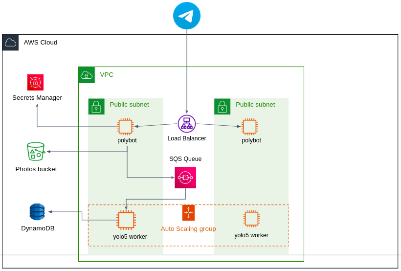

# The Polybot Service: AWS Project

# About the Project  
This project is a Telegram bot that receives images from users, analyzes them using an AI model called YOLOv5, and returns a list of detected objects in the image.  
In addition, the project demonstrates advanced DevOps capabilities, including:  

- Automatically creating cloud infrastructure on AWS using Terraform (Infrastructure as Code).  
- Using Ansible to connect to AWS EC2 virtual machines and install Docker containers, both for the AI model and the Telegram bot server.

---

# Architecture

---

# Skills Demonstrated in the Project  
- **Infrastructure as Code (IaC):** Building and managing AWS cloud infrastructure using Terraform code.  
- **Configuration Management:** Using Ansible to automate machine deployment and container installation.  
- **CI/CD:** Creating an automated pipeline with GitHub Actions to update infrastructure and application.  
- **Containerization (Docker):** Packaging the AI model and bot inside containers for portability and efficiency.  
- **AI Integration:** Integrating the YOLOv5 model for object detection in images.  
- **Cloud Computing:** Leveraging AWS services for reliable and scalable deployment.

---

# Technologies and Tools Used  

### AWS Services:  
- **SQS:** Message queue to decouple system components.  
- **VPC:** Private and secure AWS network.  
- **S3:** Static file storage.  
- **DynamoDB:** Fast and flexible NoSQL database.  
- **Security Groups:** Firewalls managing access.  
- **IAM Roles & Policies:** Security permissions management.  
- **Instance Profile:** Linking IAM permissions to EC2 instances.  
- **Load Balancer & Target Groups:** Distributing traffic across machines.  
- **ACM:** SSL/TLS certificate management.  
- **Route53:** Domain management and routing.  
- **Auto Scaling Groups:** Automatic scaling of instances based on load.

### Other Tools:  
- **Terraform:** Automated infrastructure creation.  
- **Ansible:** Configuration management and deployment.  
- **Docker:** Packaging applications into containers.  
- **SSH:** Secure access to machines.  
- **GitHub Actions:** CI/CD automation tool.  
- **Linux Command Line Tools:** For connection testing and data gathering.

---

# Summary  
This project demonstrates how to combine multiple technologies: Terraform for infrastructure as code, AWS cloud services, Ansible for deployments and installations, Docker for containerization, and GitHub Actions for automating the entire process.

---

# Getting Started with the Project  

1. **Create a Telegram Bot:**  
   Create a new bot via BotFather and obtain a unique token.

2. **Set GitHub Secrets:**  
   Add 4 secrets in your GitHub repository:  
   - `AWS_ACCESS_KEY_ID` – AWS access key ID.  
   - `AWS_SECRET_ACCESS_KEY` – AWS secret access key.  
   - `AWS_SECRET_REGION` – AWS deployment region (e.g., `us-east-1`).  
   - `KEY_PEM` – Private SSH key for EC2 access.

3. **Store the Bot Token in AWS Secrets Manager:**  
   Create a new secret named `BotTelegram/token` (or another name, but update the code accordingly).

4. **Update the Domain in the Code:**  
   In the file `/polybot/app.py`, line 39, replace `TELEGRAM_APP_URL` with your real domain.

5. **Update Terraform Variables:**  
   In the file `TF/infra-vars.tfvars`, update the values to match your project.

---

Once these steps are completed, you can run the project, and the bot will automatically detect objects in images sent to it via Telegram.

---yy
